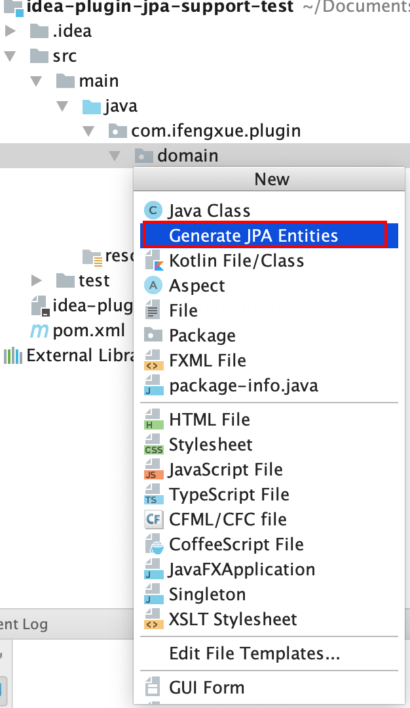
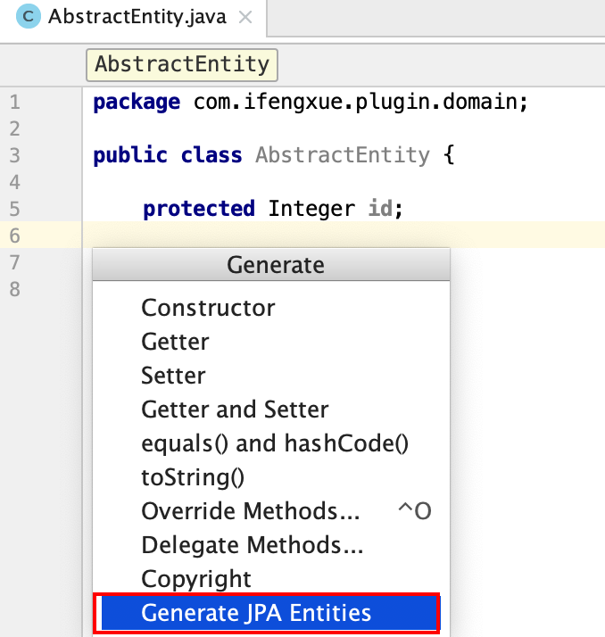
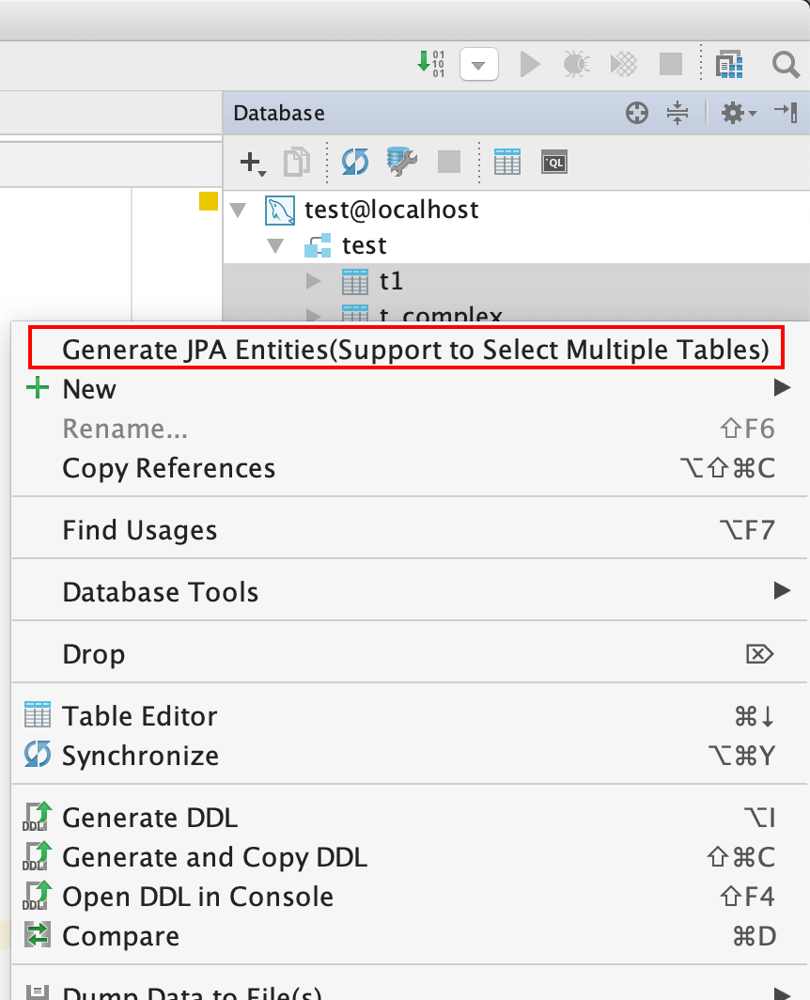
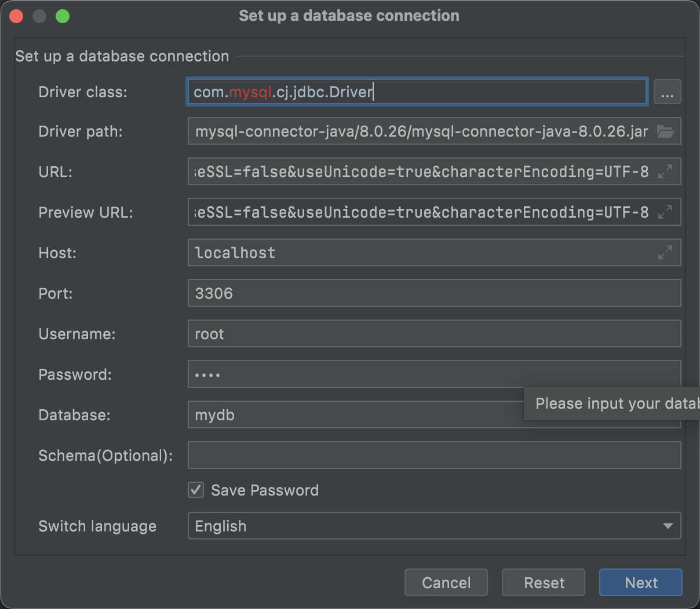
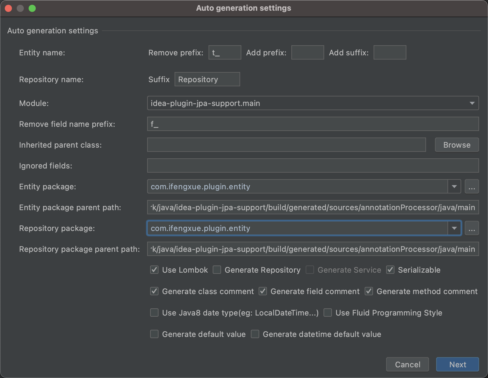
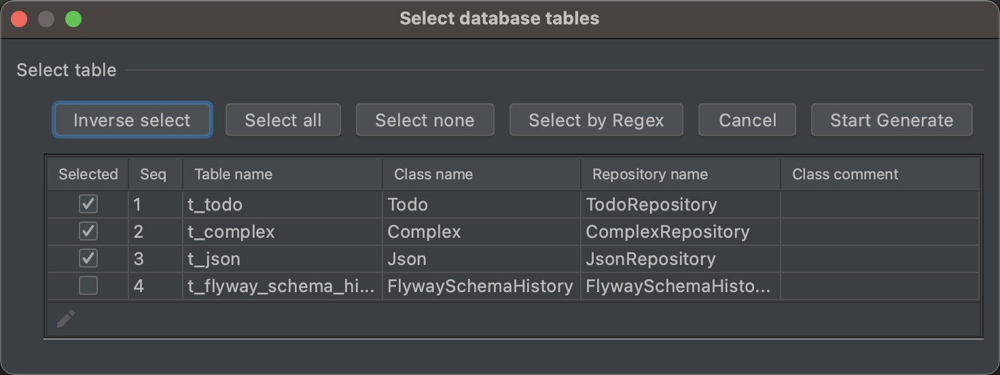

# 使用说明(Guide)
## 激活插件(Active Plugin)
1. 方式 1(Way 1) `Generate JPA Entities`  

2. 方式 2 (Way 2) -> 编辑区右击(Edit area right click) `Generate JPA Entities`  

3. `Database`右击(`Database` right click) 

> 仅支持 IDEA Ultimate(IDEA Ultimate only)
4. 快捷键(Hot key)
 - Mac: `Command + N`
 - Windows: `Alt + Insert`
 
## 演示(Demo)
1. 步骤 1(Step 1) 

2. 步骤 2(Step 2) 

3. 步骤 3(Step 3) 

