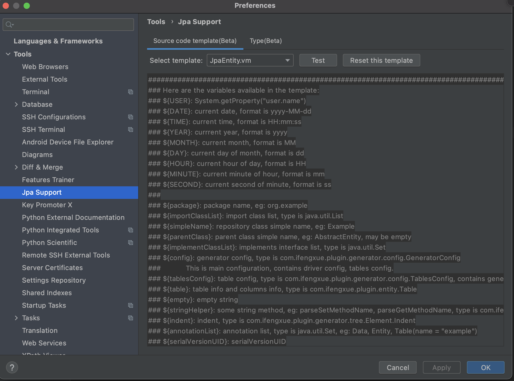
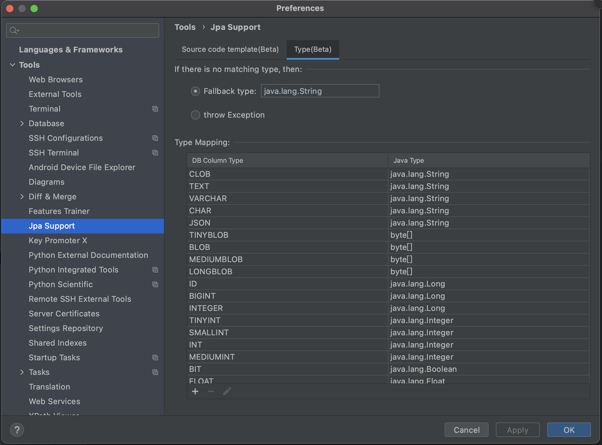

- [English](README.md)
- [中文文档](README_zh.md)

# Guide

## Active Plugin

1. Way 1 `Generate JPA Entities`  
   

2. Way 2 -> Edit area right click `Generate JPA Entities`  

3. `Database` right click 

> IDEA Ultimate only

4. `Hot key`

- Mac: `Command + N`
- Windows: `Alt + Insert`

## Usage

1. Step 1 

2. Step 2 

3. Step 3 

## Other settings

1. Custom template 

2. Custom type mapping 

## Related articles

1. [Use Tutorial Video YouTube](https://www.youtube.com/watch?v=CynidTePOys)

## Sponsor

