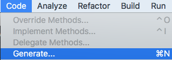
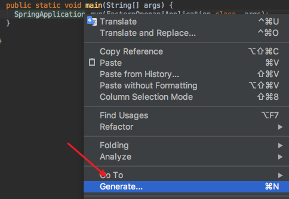
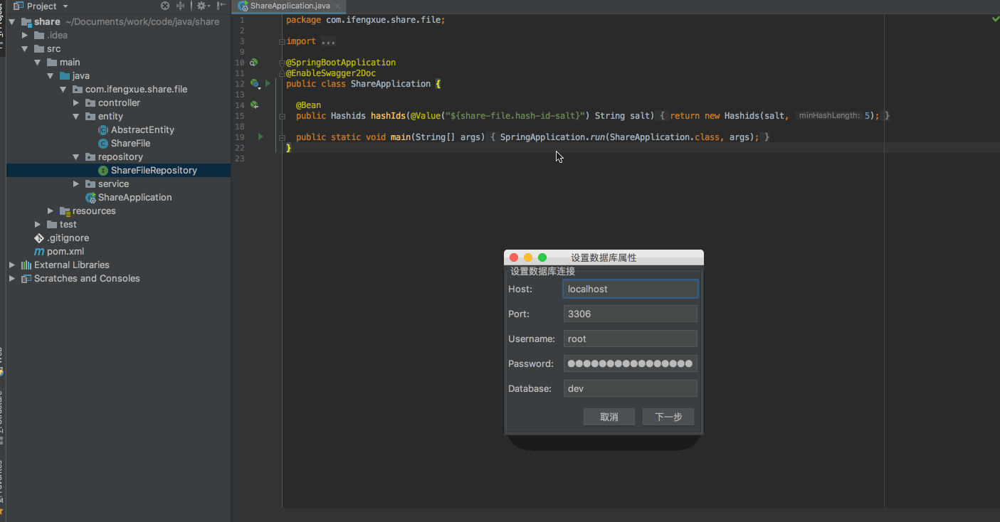

# 使用说明(Guide)
## 激活插件(Active Plugin)
1. 菜单栏(Menu Bar) `Code -> Generate -> Jpa Entities`

2. 编辑区右击(Edit area right click) `Generate -> Jpa Entities`

3. 快捷键(Hot key)
 - Mac: `Command + N`
 - Windows: `Alt + Insert`

