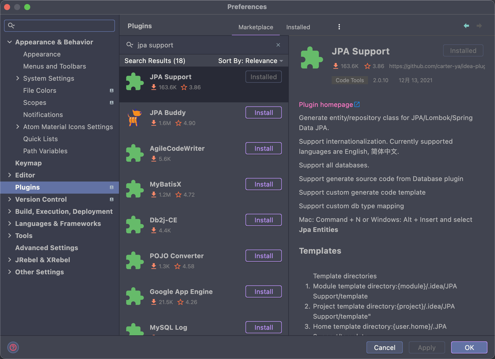
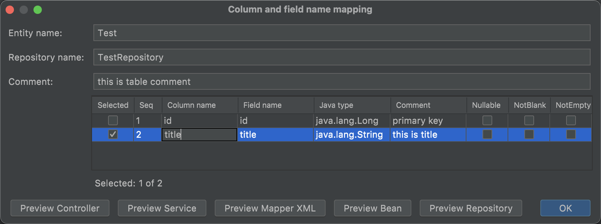

- [English](README.md)
- [中文文档](README_zh.md)

# 使用说明

## 安装

1. 通过[Jetbrains Plugin Marketplace](https://plugins.jetbrains.com/plugin/10707-jpa-support)在线安装
2. 通过[Github Releases](https://github.com/carter-ya/idea-plugin-jpa-support/releases)离线安装
3. 通过插件市场搜索安装
   

### 激活

#### 方式1

#### 方式2

在编辑器按`Command + N`或`Ctrl + N`快捷键

#### 方式3

> 仅支持`IDEA Ultimate`

### 使用

1. 配置数据库连接

> 通过`Database`插件时将跳过该步骤

2. 配置生成器

3. 选择要生成的表

> 双击表名可以进入详细设置
> 

## 其他配置

1. 自定义模板

支持在`{module}/.idea/JPA Support/template`，`{project}/.idea/JPA Support/template`
，`{user.home}/.JPA Support/template`自定义模板，查找优先级为：`module>project>user.home>default`。
当前支持的[模板类型](src/main/resources/template)

2. 自定义数据类型映射

## 相关文章

1. [使用教程视频-英文 -（Use Tutorial Video-English） YouTube](https://www.youtube.com/watch?v=CynidTePOys)

## 感谢赞助

